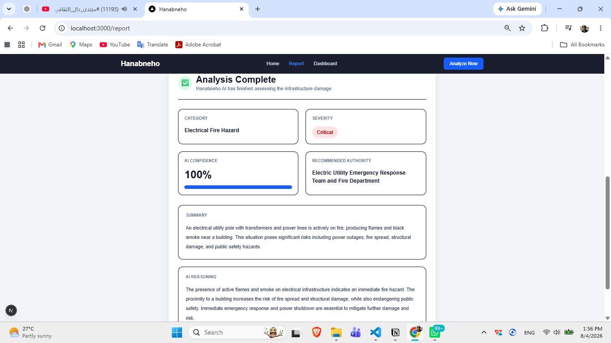
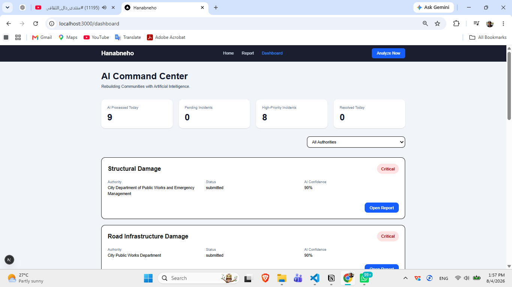

# Hanabneho

> **Rebuilding Communities with Artificial Intelligence.**

## A single photo can reveal a damaged road.

But it cannot tell us what should happen next.

After a disaster or conflict, communities don't suffer from a lack of information. They suffer from a lack of time.

Every day, citizens capture photos of collapsed bridges, damaged roads, destroyed schools, and failing electrical infrastructure. Those images contain valuable information, but turning thousands of reports into coordinated recovery decisions remains a slow and largely manual process.

Someone has to review every report, understand what happened, estimate the severity, determine who is responsible, and decide what deserves immediate attention.

That delay has real consequences.

I kept asking myself one question.

> **What if a single photo could become the starting point for rebuilding a community?**

That question became Hanabneho.

Rather than building another AI demo, I wanted to explore how Artificial Intelligence could support real decision-making.

Hanabneho transforms an unstructured citizen report into structured recovery intelligence.

A citizen uploads a photo.

Behind the scenes, AI analyzes the damage, reasons about its impact, recommends the responsible authority, and stores the assessment in an operational dashboard where recovery teams can prioritize what matters most.

The project was inspired by Sudan's recovery journey, but the challenge extends far beyond one country.

Communities everywhere face the same question after a crisis:

> **How do we transform thousands of reports into faster, smarter recovery decisions?**

Hanabneho is my attempt to answer that question.

---

# From an Idea to an AI System

Building Hanabneho wasn't just about integrating a vision model into a web application.

The goal was to design a complete AI workflow capable of transforming unstructured citizen reports into structured information that supports real recovery decisions.

To achieve that, I approached the project as an AI engineering problem rather than a machine learning experiment.

Instead of asking:

> *"Can the model recognize infrastructure damage?"*

I asked:

> *"How should an intelligent system reason about this report from the moment a citizen submits it until it reaches the people responsible for taking action?"*

That perspective shaped every architectural decision in this project.

---

# How Hanabneho Works

The experience is intentionally simple for the citizen.

1. A citizen uploads an image of damaged infrastructure with a short description.
2. The backend creates a report and stores the submitted evidence.
3. An AI workflow analyzes the infrastructure damage.
4. The system estimates severity and generates a structured assessment.
5. The appropriate authority is recommended.
6. The assessment is stored and becomes available in the operational dashboard for monitoring and prioritization.

```text
Citizen
      │
      ▼
Submit Report
      │
      ▼
AI Vision Analysis
      │
      ▼
Reasoning Engine
      │
      ▼
Damage Assessment
      │
      ▼
Authority Recommendation
      │
      ▼
Operations Dashboard
```

---

# Engineering Decisions

Hanabneho was built around a few principles that I believe are essential when developing AI applications.

### AI should support decisions, not replace them.

The objective is not to automate human judgment, but to provide structured information that helps decision-makers respond more efficiently.

### Architecture matters as much as the model.

The backend follows a layered architecture that separates domain logic, repositories, services, API endpoints, and AI components. This keeps the system maintainable, testable, and easy to extend.

### AI is one component of a larger system.

A useful AI product requires much more than inference. It also needs reliable APIs, persistence, data flow, and a user experience that fits the people who will actually use it.

### Real-world problems deserve end-to-end solutions.

Hanabneho is more than an image analysis application. It demonstrates how AI can be integrated into a complete workflow that transforms raw citizen reports into actionable recovery intelligence.

---

# Technologies

### Frontend

- Next.js
- React
- TypeScript
- Tailwind CSS

### Backend

- FastAPI
- Python
- SQLAlchemy
- SQLite

### Artificial Intelligence

- OpenAI GPT-4.1 Vision
- LangGraph
- Multi-Agent Workflow

---

# Project Structure

```text
frontend/
backend/
```

The backend follows Clean Architecture, separating Domain, Services, Repositories, API, Database, and AI Intelligence into independent layers.

---

# Screenshots

## Landing Page


---

## Citizen Reporting


---

## AI Assessment



---

## Operations Dashboard



---

# Running the Project

## Backend

```bash
cd backend

uv sync

uv run uvicorn backend.main:app --reload
```

## Frontend

```bash
cd frontend

npm install

npm run dev
```

---

# Future Work

- Interactive maps for incident visualization
- Retrieval-Augmented Generation (RAG) for recovery guidelines
- Real-time notifications
- Country-specific authority routing
- Satellite imagery integration
- Historical recovery analytics
- Citizen report tracking

---

# What I Learned

Hanabneho taught me that building AI products is not only about choosing the right model.

It is about designing systems where AI, software architecture, data persistence, APIs, and user experience work together to solve a meaningful problem.

This project strengthened my understanding of building AI systems that move beyond prediction and actively support real-world decision-making.

---

# About Me

I'm **Abualgasim Ibrahim**, an AI Engineer passionate about building intelligent systems that solve meaningful real-world problems.


---

## License

MIT License